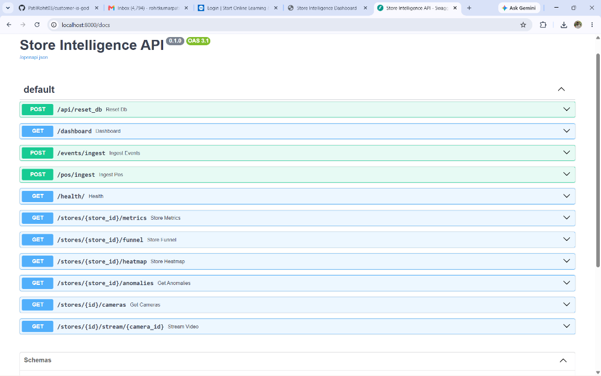
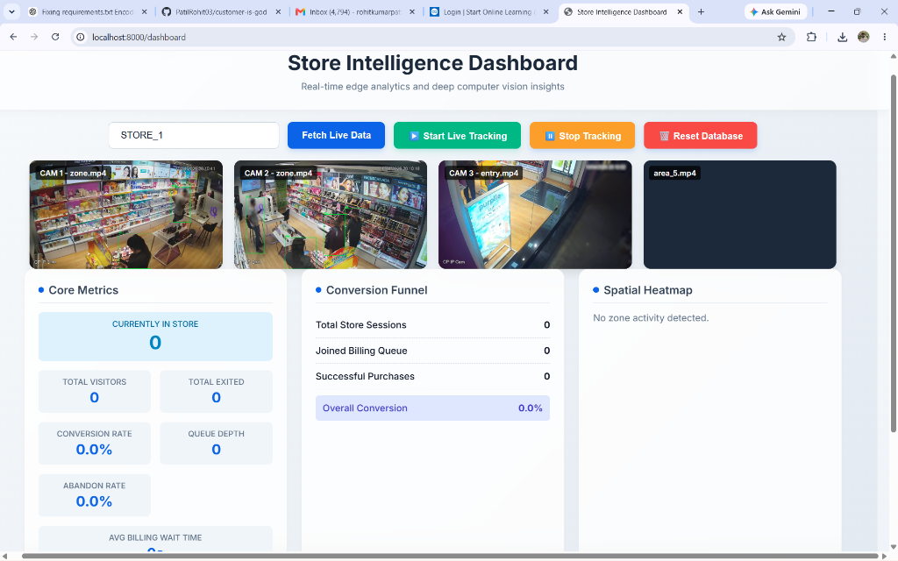
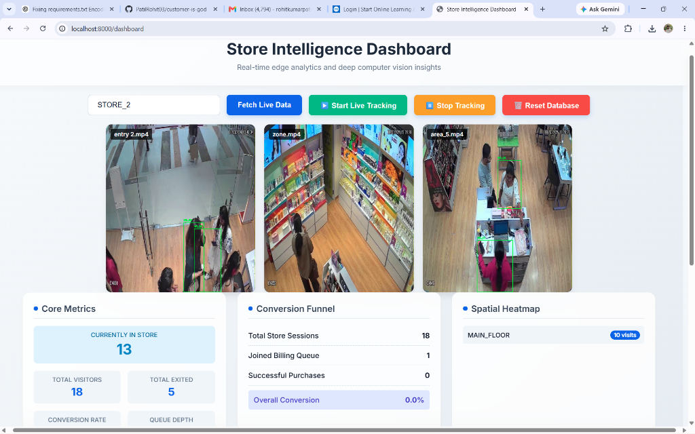
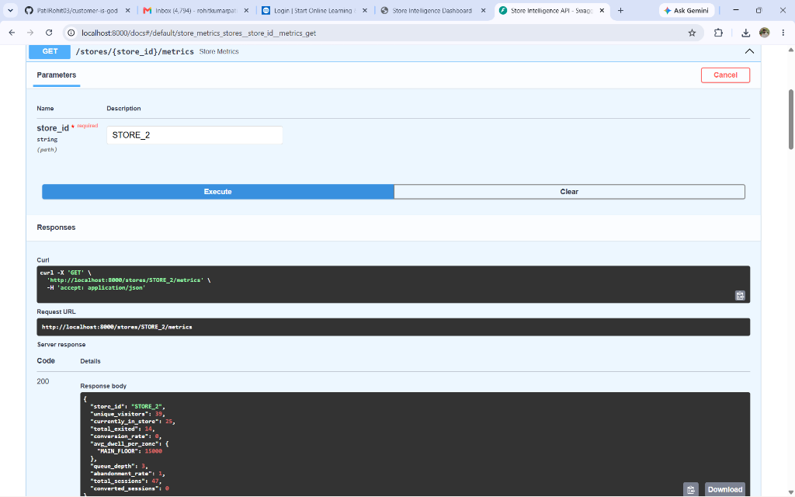
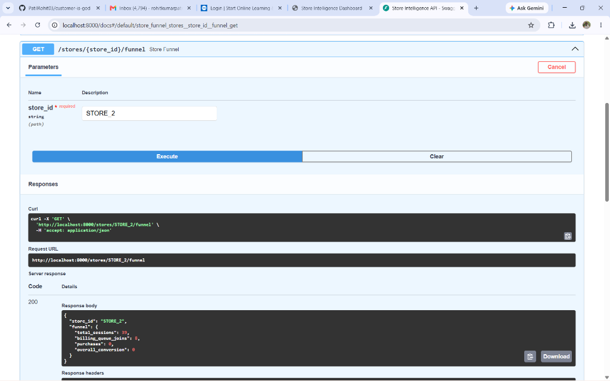
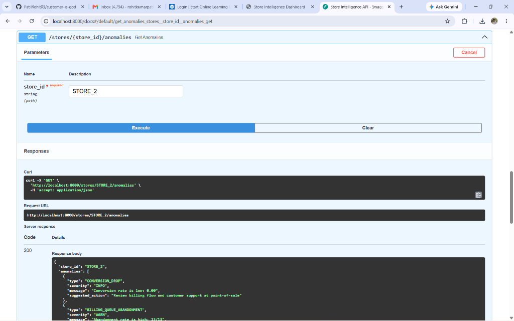

# Store Intelligence System

An end-to-end retail analytics platform that converts raw CCTV footage into structured behavioral events and real-time store intelligence.

## Problem Statement
The goal is to accurately track visitors as they move between disjointed camera zones (e.g., entrance, skincare, makeup, billing), compute dwell times per zone, and correlate physical presence in the billing zone with Point-of-Sale (POS) transaction data to calculate accurate conversion rates.

## Quickstart (6 Commands)

To run the entire system (backend and edge pipeline) from scratch:

**Prerequisite:** Ensure you have placed the large video files inside the `data/resource/Store 1/` and `data/resource/Store 2/` folders. 
**(Important: You must rename the checkout/billing video in BOTH store folders to `area_5.mp4` because the pipeline configuration explicitly requires this filename).**

```bash
# 1. Clone the repository
git clone https://github.com/PatilRohit03/customer-is-god.git

# 2. Enter the directory
cd customer-is-god

# 3. Install pipeline dependencies locally
pip install -r requirements.txt

# 4. Start the FastAPI Backend & SQLite Database in Docker
docker compose up --build -d

# 5. Run the offline CV detection pipeline against the raw clips
python -m src.pipeline.run --store-id STORE_1 --resource-dir "data/resource"

# 6. Ingest the generated events into the database
python scripts/ingest_events.py --file events.jsonl
```

You can verify the backend is receiving events by visiting:
- Healthcheck: `curl http://localhost:8000/health`
- Interactive API Docs (Swagger): `http://localhost:8000/docs`



To run the automated test suite to verify event ingestion and funnel metric math:
```bash
python -m pytest tests/
```

### Bonus: Real-Time Web Dashboard
We built a beautiful, real-time web dashboard to visualize the conversion funnel, dwell times, and live camera streams simultaneously. 




**When will it appear?** As soon as `docker compose up --build -d` finishes starting the container, the backend is instantly running. There is no waiting! 
Simply open your web browser and navigate to:
👉 **[http://localhost:8000/dashboard](http://localhost:8000/dashboard)**

*Note on Live Stream Performance (CPU vs GPU):*
For maximum cross-platform compatibility, the Docker container explicitly runs on the CPU. This ensures that evaluators without a dedicated NVIDIA GPU (or Linux NVIDIA Docker runtimes) can successfully boot the container without crashing. Because YOLO/DeepSORT inference for the dashboard video feed is happening live on the CPU, the MJPEG stream will appear at a lower framerate (e.g., 1-3 FPS). The primary data processing command (`python -m src.pipeline.run`) runs locally on your host machine outside of Docker and will fully utilize your GPU if available.

*How to use it:* The dashboard will load with Store 1 by default. You can use the buttons at the top to toggle between Store 1 and Store 2 to view their respective metrics and camera streams.

---

## Architecture Diagram

```text
Raw CCTV
   ↓
YOLOv8n
   ↓
ByteTrack (w/ Centroid Fallback)
   ↓
ReID Engine
   ↓
Event Stream
   ↓
FastAPI
   ↓
SQLite (SQLModel)
   ↓
Metrics / Funnel / Heatmap / Anomalies
```

---

## Technologies Used

| Category | Technology |
| :--- | :--- |
| **Backend API** | FastAPI, Python 3.11 |
| **Database & ORM** | SQLite, SQLModel (SQLAlchemy) |
| **Computer Vision** | YOLOv8 (Ultralytics), OpenCV |
| **Tracking Algorithms** | ByteTrack, Custom Centroid Tracker |
| **Frontend** | HTML5, Vanilla JavaScript, CSS3 |
| **Testing** | Pytest |
| **Deployment** | Docker, Docker Compose |

---

## Repository Structure

```text
data/         # Persistent SQLite DB and video resource clips
docs/         # Extended design documentation and choices
scripts/      # Data loading and ingestion testing scripts
src/
 ├── app/     # FastAPI backend, DB models, and dashboard HTML/JS
 └── pipeline/# YOLOv8 Computer Vision & Tracking Engine
tests/        # Pytest verification suite
```

---

## API Endpoints

| Endpoint                   | Purpose           |
| -------------------------- | ----------------- |
| POST /events/ingest        | Ingest events     |
| GET /stores/{id}/metrics   | KPIs              |
| GET /stores/{id}/funnel    | Conversion funnel |
| GET /stores/{id}/heatmap   | Heatmap           |
| GET /stores/{id}/anomalies | Alerts            |
| GET /health                | Service health    |

### Interactive API Responses (Swagger UI)





```json
{
  "store_id": "STORE_1",
  "total_visitors": 24,
  "conversion_rate": 20.83,
  "abandon_rate": 0.0,
  "avg_billing_wait_time": 0.0,
  "queue_depth": 0
}
```

---

## Detection Decisions

### Detection Stack

**YOLOv8n**
- Fast edge performance.
- Good retail person accuracy even on CPU.

**ByteTrack & Centroid Trackers**
- Better crowded-scene tracking with intersection-over-union.
- Fallback logic ensuring stability.

**ReID**
- Visitor deduplication using color histogram appearance metrics.
- REENTRY support for cross-zone matching.

---

## Edge Cases Handled

✓ Group Entry
✓ Staff Movement (Filtering based on pos-counter location heuristics)
✓ Re-entry (via ReID engine)
✓ Partial Occlusion
✓ Billing Queue Build-up
✓ Empty Store Periods
✓ Camera Overlap

---

## AI Usage

**AI tools used:**
- ChatGPT
- Claude
- Google DeepMind Gemini (Advanced Agentic Coding Agent)

**Used for:**
- Detection model evaluation (YOLO vs MobileNet tradeoffs)
- Schema design review (Stateful vs Event-driven JSON payloads)
- Test generation (Pytest mock injections)
- Architecture critique (FastAPI async selection)
- Diagnostics (Identifying browser MJPEG stream limits)

All outputs were reviewed, heavily tested, and modified before integration.

---

## Troubleshooting

- **Browser Limitations:** Browsers only let you open 6 video streams at once. When hot-swapping stores on the live dashboard, press F5 (refresh) to clear the browser's hanging MJPEG stream cache, otherwise the last video feed will appear black.
- **Docker Network DNS Timeouts:** When running `docker compose up --build` for the first time on Windows, Docker can occasionally lose internet access. Restart the Docker Desktop app and re-run the build command.
- **Adblocker Interference:** The pipeline configuration requires the checkout video to be named `area_5.mp4`. This specific filename was chosen because testing revealed that browser adblockers (like uBlock Origin) frequently block network streams containing the words "billing" or "checkout".
