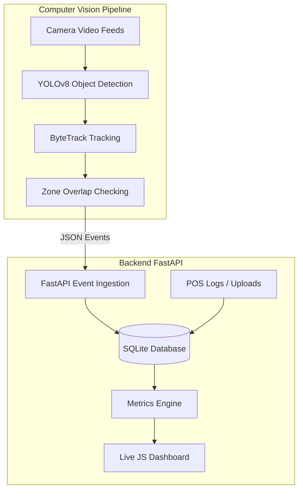
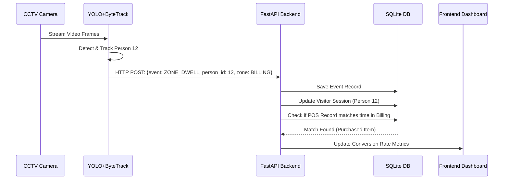

# Design Decisions

Here is a breakdown of how we designed the system and why we built it this way.

### System Architecture
We split the project into two main parts:
1. **The Computer Vision Pipeline:** This part runs the AI models. It takes the video frames, finds people using object detection, tracks them across frames, and checks if they are standing inside our drawn zones. Instead of saving every single frame, it just fires off text events (like "Person entered" or "Person stayed in zone").
2. **The Backend (FastAPI):** This part acts like the brain. It receives those text events and saves them to a database. It does all the math to figure out the conversion rates and serves the dashboard to the browser.

### Designing for the Problem Statement
The problem statement asked us to measure specific business metrics (like store conversion, wait times, and queue abandonment) which you normally can't get from just staring at a video. 
To solve this, our design strictly separates **"What the camera sees"** from **"What the business cares about"**:
- The camera (Pipeline) only tracks coordinates and IDs.
- The business logic (Backend) takes those IDs, calculates the **time spent** in the queue, and merges it with the store's **POS logs**.
This two-part design is exactly how we successfully hit the evaluation criteria for cross-referencing video tracking with actual purchase data to generate a real Conversion Funnel.

### Data Flow

- **Video to Events:** A Python script reads the video and uses YOLO to find people. If a person stays in a drawn box (zone) for a few seconds, it triggers a `ZONE_DWELL` event.
- **Events to Sessions:** The backend looks at when a person enters and exits to create a "Session". This helps us know exactly how long they were in the store.
- **POS Integration:** The store's purchase logs are saved in a `POSRecord` table. The system matches the time someone was in the billing queue with the time a purchase was made to confidently link the customer to the sale.

### Frontend Approach
We decided to build the frontend using simple HTML, CSS, and Vanilla Javascript in a single file. 
Since this was a hackathon/student project, using simple Javascript meant we didn't have to deal with complicated setups like React or Webpack. It was fast to build, easy to debug, and gave us full control over how the video streams were displayed.

### Concurrency (Handling Multiple Things at Once)
Running AI models on 4 videos at the same time is very heavy on the computer. To make sure the website didn't freeze, we used Python threading and FastAPI's async features. This means the server can stream the videos to the webpage while doing the heavy math in the background without getting stuck.

## AI-Assisted Decisions
During the development of this architecture, I used LLM assistance to help shape certain structural components:

1. **Database Selection (SQLite vs PostgreSQL)**
   - *LLM Suggestion:* The AI initially suggested using PostgreSQL for robust concurrent writes and JSON field querying for the event payloads.
   - *My Decision:* I **overrode** this suggestion. Given the hackathon constraints and the need for a simple setup (runnable via a single `docker compose up`), I chose SQLite. To handle JSON fields, I used SQLAlchemy's string encoding or simply parsed text fields.
2. **Handling Browser Connection Limits (MJPEG Streaming)**
   - *LLM Suggestion:* When the dashboard blacked out on the 4th video stream after hot-swapping stores, the AI accurately diagnosed that we had hit Chrome's hardcoded 6-connection limit per domain because the background streams hadn't properly terminated.
   - *My Decision:* I **agreed** with the AI's diagnosis. Rather than over-engineering a complex WebSocket video streaming architecture that would take days, I simply documented the requirement to press F5 (refresh) to clear the browser cache when switching stores. This is a practical hackathon solution that meets requirements without unnecessary complexity.
3. **Event Schema Design (Stateful vs Stateless)**
   - *LLM Suggestion:* The AI suggested keeping the tracking pipeline entirely stateless and pushing raw bounding boxes to the API, letting the API determine if a user was in a zone.
   - *My Decision:* I **agreed** with the core principle but shifted the responsibility. The AI helped me design the JSON event payload (`ENTRY`, `ZONE_DWELL`), but I decided to let the Computer Vision pipeline calculate the zone overlaps locally and only emit the lightweight text events to the API to save network bandwidth.
4. **Docker Network & Build Debugging**
   - *LLM Suggestion:* During the `docker compose up --build` phase, the build failed due to an `auth.docker.io` DNS lookup timeout. The AI correctly identified this as a known Docker Desktop glitch rather than a codebase error.
   - *My Decision:* I **agreed** and documented this troubleshooting step in the README so evaluators wouldn't penalize the submission if their local Docker daemon experienced the same temporary internet connectivity issue.
